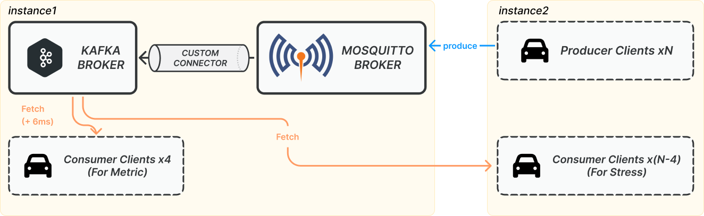

# Testbed for `Kafka-Boost`

This project is a C++ testbed for `librdkafka` and `mosquitto`, primarily serving as a research platform for the paper `Kafka-Boost: An Adaptive Service Boosting Data Streaming Platform for V2X In Edge`. It is designed for performance testing and experimentation with Kafka producers and consumers, particularly in a V2X (Vehicle-to-Everything) context. It utilizes C++20, CMake for building, and vcpkg for dependency management.

## Prerequisites

*   A C++20 compatible compiler (e.g., GCC 10+, Clang 12+)
*   CMake (version 3.30 or later)
*   Git

## Project Structure

```
├── CMakeLists.txt                       # Main CMake build script
├── vcpkg.json                           # vcpkg dependencies
├── config/                              # Configuration files
├── libmoniq/                            # Submodule for monitoring
├── script/                              # Scripts
│   ├── mqtt_static_v2x_test.sh            # Script for the experiments corresponding to Figure 9~11
│   ├── mqtt_dynamic_v2x_test.sh           # Script for the experiments corresponding to Figure 12~13
│   └── ...                                # Helper scripts for experiment automation
└── src/
    ├── apps/                            # Main application executables
    │   ├── v2x_expr_consumer.cpp
    │   ├── v2x_expr_custom_connector.cpp
    │   └── v2x_expr_mqtt_producer.cpp
    └── common/                          # Common code shared across applications
```

You can find more details for each application [here](docs/APPS_MANUAL_RUN.md)

## Building the Project

1.  **Clone the repository with submodules:**

    ```bash
    git clone --recurse-submodules https://github.com/ESeokhwan/rdkafka_testbed.git
    cd rdkafka_testbed
    ```

2.  **Bootstrap vcpkg:**

    **Linux/macOS:**
    ```bash
    ./vcpkg/bootstrap-vcpkg.sh
    ```
    **Windows:**
    ```cmd
    .\vcpkg\bootstrap-vcpkg.bat
    ```

3.  **Configure and build with CMake:**

    To build, run the following commands. Then, the executables of applications will be placed in the `bin/` directory.
    ```bash
    cmake --preset <preset-name>
    cmake --build --preset <preset-name>
    ```
    Once built, the application executables will be placed in the `bin/` directory.
    > **Note:** This project supports various CMake presets, including `linux-release`, `win-64-release`, `macos-release`, and `macos-arm64-release`. Please refer to [`CMakePresets.json`](CMakePresets.json) for the full list of available presets.

## Replicating the Experiments

The experimental setup is distributed across two server instances to isolate broker and client workloads, as illustrated below.



### Instance 1: Broker and Metric Consumers
This instance hosts the core data pipeline and metric-gathering clients:

*   **Kafka Broker**: The central message bus in the edge server for the V2X data.
*   **Mosquitto Broker**: To support robust ingestion from many clients over unreliable links, this broker acts as an ingestion point, receiving data from each client and buffering it for the connector.
*   **Custom Connector**: A bridge that forwards messages from the Mosquitto broker to the Kafka broker.
*   **Metric Consumer Clients (x4)**: Four dedicated consumer clients connect to the Kafka broker to measure end-to-end latency and reliability for different service types (`sensor info. sharing`, `info. sharing`, `platooning-lower`, and `platooning-lowest`). A 6ms artificial delay is added to simulate network round-trip time, as these consumers run on the same instance as the brokers.

### Instance 2: Producer and Stress Clients
This instance generates the workload for the system:

*   **Producer Clients (N)**: A variable number of clients that generate and send data to the Mosquitto broker on Instance 1.
*   **Stress Consumer Clients (N-4)**: These clients connect to the Kafka broker to generate additional consumer load on the edge server, helping to simulate high system load on the edge server.

### Component Implementation

The source code for the clients and the connector can be found in the `src/apps/` directory:

*   **Producer Client**: `src/apps/v2x_expr_mqtt_producer.cpp`
*   **Metric Consumer Client**: `src/apps/v2x_expr_consumer.cpp`
*   **Custom Connector**: `src/apps/v2x_expr_custom_connector.cpp`


## Static V2X Experiments (Figures 9-11)

The static V2X experiments measuer key performance metrics with a fixed number of V2X Clients within the coverage area.

This experiment is orchestrated by the `script/mqtt_static_v2x_test.sh` script. This script automates setting up the test environment, launching the clients and connector, and running the experiment. It allows for configuring various settings, such as the number of clients, the test duration for each run and more. You can find more details in the [script documentation](docs/TODO.md)

### Script Usage

A typical command to run the script is shown below.

```bash
./script/mqtt_static_v2x_test.sh --config config/your.config --duration 120 --num-car 10,20,30
```

### Configuration

This script has three levels of configuration, in order of precedence:
1.  **Command-line arguments** (e.g., `--duration 120`): Highest precedence.
2.  **Configuration file** (e.g., `config/your.config`): Values defined here override the defaults.
3.  **Default values** in the script: Lowest precedence.

It is recommended to use a configuration file for fixed settings, such as broker addresses and component root paths. You can view all available options in the [script documentation](docs/TODO.md).

### Execution Flow

The script iterates through a predefined list of client numbers (e.g., 10, 20, 40... clients) and performs the following steps for each number:

1.  **Start Connector**: Launches the custom connector application, which bridges the Mosquitto and Kafka brokers.
2.  **Clear Consumer Groups**: Deletes any existing Kafka consumer groups from previous runs to ensure a clean start.
3.  **Start Metric Consumers**: Runs the 4 dedicated metric consumer clients that connect to the Kafka broker. These clients are responsible for measuring latency and reliability.
4.  **Start Stress Consumers**: Runs a number of stress consumer clients to ensure the total consumer count matches the number of producers. These connect to the Kafka broker to generate background load.
5.  **Verify Consumers**: Waits a moment and checks to ensure all consumer clients have successfully connected to their respective groups.
6.  **Run Producers**: Starts the producer clients, which generate the V2X message load for the duration of the test.
7.  **Clean Up**: Once the producers have finished, the script terminates the connector and all consumer clients.
8.  **Output Results**: Fetches and prints the log file from the metric consumers, which contains the results (e.g., end-to-end latency) for the completed run.

After completing the run for one client number, the script waits for a brief period before starting the next run with an increased number of clients.


## Dynamic V2X Experiments (Figures 12-13)

The dynamic V2X experiments measure key performance metrics when the number of V2X clients in the coverage area varies over time. In this experiment, the number of clients increases at specified intervals and then decreases in the same manner.

This experiment is orchestrated by the `script/dynamic_v2x_test.sh` script. This script automates setting up the test environment, launching the clients and connector, and running the experiment. It allows for configuring various settings, such as the number of clients at each step, the duration of each step, and more. You can find more details in the [script documentation](docs/TODO.md).

### Script Usage

A typical command to run the script is shown below:

```bash
./script/mqtt_dynamic_v2x_test.sh --config config/your.config --step-interval 20 --final-hold 20 --step-cars 10,20,30,40,50
```

### Configuration

This script has three levels of configuration, in order of precedence:
1.  **Command-line arguments** (e.g., `--step-interval 20`): Highest precedence.
2.  **Configuration file** (e.g., `config/your.config`): Values defined here override the defaults.
3.  **Default values** in the script: Lowest precedence.

It is recommended to use a configuration file for fixed settings, such as broker addresses and component root paths. You can view all available options in the [script documentation](docs/TODO.md).

### Execution Flow

The script executes a single dynamic scaling test that progressively increases the load to a maximum point and then decreases it. It iterates through a list of target client numbers (e.g., 10, 20... 120 cars) and performs the following steps:

1.  **Start Connector**: Launches the custom connector application to bridge the brokers.
2.  **Clear Consumer Groups**: Deletes any existing Kafka consumer groups to prepare for the maximum number of clients defined in the test steps.
3.  **Start Metric Consumers**: Runs the 4 dedicated metric consumer clients. These run continuously throughout the entire test to measure latency and reliability across all phases.
4.  **Incremental Scale Up**: Iterates through the step list. For each step, it launches a new batch of stress consumers and producers (in the background) to increase the total traffic to the next target level. It waits for the specified `step-interval` between each increment.
5.  **Stable Hold**: Upon reaching the maximum number of clients, the script continues running all clients for a defined `final-hold` period to measure stability at peak load.
6.  **Incremental Scale Down**: Iterates through the active client batches in reverse order. It sequentially terminates the producers and stress consumers for each batch, waiting for the `step-interval` between stops, effectively ramping the load down.
7.  **Final Clean Up**: Once all load-generating clients have been stopped, the script terminates the connector and the metric consumers.


## Citations

If you use this testbed in your projects, please consider citing the following:

```bib
// TODO
```